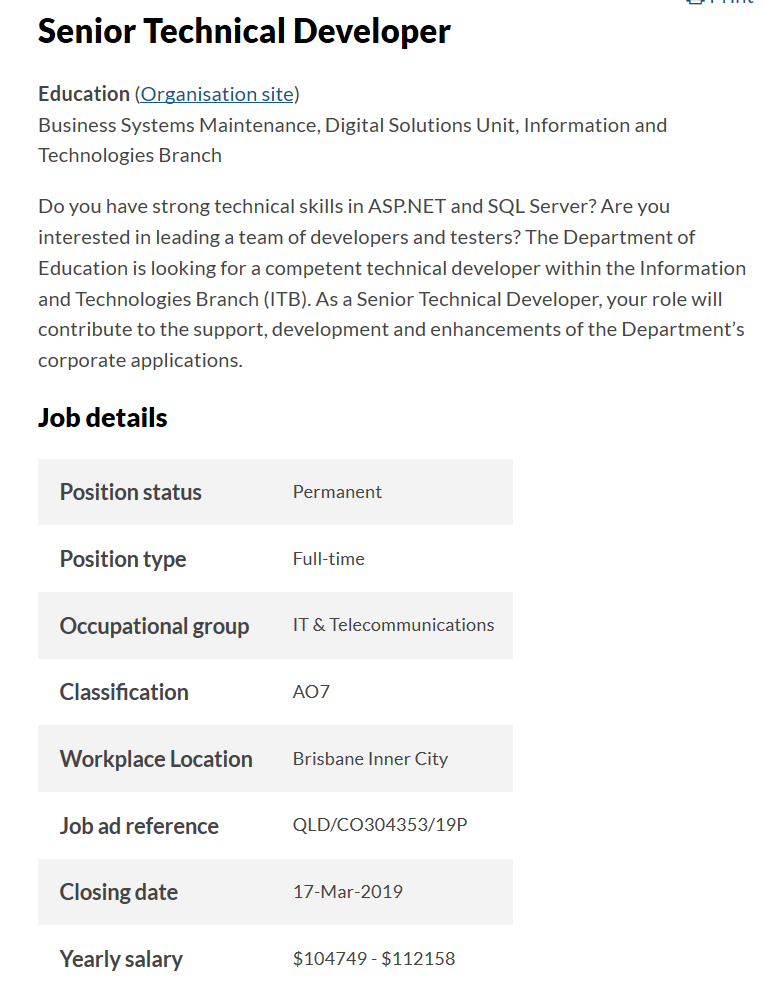
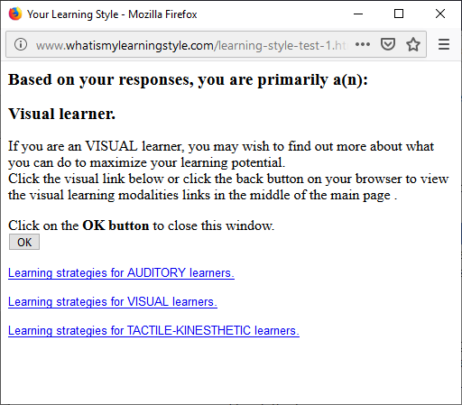
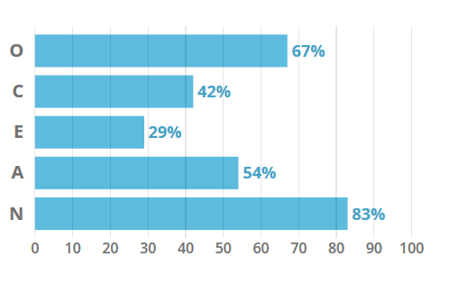

# Welcome to Darren Bonelli's GitHub Page
Student ID: S3793513 email: <S3793513@student.rmit.edu.au>

### My Interest in IT
My interest in IT began from when I was a child. I didn't have access to computers or video game consoles at home but anywhere I went where there was a PC or electronics I was drawn to them. I particularly remember looking forward to heading over to my cousin’s house and sitting on my uncles 486 computer running Windows 3.11 all day. As I grew older and was able to leave the house on my own I was drawn to anywhere that had the internet and I would enjoy sitting in libraries online, internet cafes or just sitting at a friend’s house around one PC taking turns driving towards an agreed goal. 

### My IT Experience
I began working in the ICT support field as my first fulltime job in 2005. I have been working in the industry since and have gained valuable knowledge and experience along the way. I hope to further my career opportunities in the sector by completing my bachelor's degree.

### Why I chose RMIT
I enquired through Open Universities Australia about commencing university study online and this is where I was advised RMIT offer exactly what I was after. RMIT have a solid reputation for graduates finding work post studies. At the moment I am balancing work as well as studies so the online aspect is great for me to find a healthy balance.

### What I expect to learn
I expect to become far more technical with my knowledge of IT. I expect to be able to understand computer code and be able to write and create basic programs that I can have fun with and save myself time with my day to day key responsibilities. I expect to learn more around servers and networking. I also expect to learn and develop stronger business related skills relating to the ICT field.

### A little more about me
Outside of technology my other interests are gardening - growing my own food, my pets and animals - my dog and cat, I enjoy craft beers and various whiskeys, I try to exercise and keep healthy - cycling & gym, I only speak English but am first generation of an Italian background, I'm a foodie and I like rainy evenings on the couch binge watching Netflix

### Ideal Job
<https://smartjobs.qld.gov.au/jobs/QLD-CO304353-19P>
 The position linked above **(Senior Technical Developer)** is the kind of role I would aspire to be doing within the next ten years. It is an extensive technical role that requires many years of experience in coding and development testing. The position is also for a senior person who would be a team lead and mentor to other code developers. The requirement to code and develop is not only required but many years' experience and the ability to manage and lead a team in a very technical area. The skills required would be a degree in IT as well as training and qualifications in business management. As of right now I am very junior in my skills and experience, I have no knowledge or skills in writing code and have no prior tertiary education in IT - that's a big reason why I'm here! I hope to successfully complete my degree in IT and obtain the skills and experience to become a developer and tester and then from there gain experience on the job site to one day be qualified and experienced to take on such a position.

### Personal Profile
The **Myers-Briggs Type Indicator test** test I performed was via url; 
 <https://www.truity.com/test/type-finder-personality-test-new>
 The results for my answers determine I am an Introverted person by 61%.
I lean towards intuition over sensing by 54%.
I have a slight preference to thinking over feeling at 56%.
I am said to perceive over judge by 59%.
My personality types are said to be a healer, a craftsperson and an architect.

The **Learning style test** I participated in was via url; 
 <http://www.whatismylearningstyle.com/learning-style-test-1.html>
 The results indicate that I am a "Visual learner" and I would 100% agree with that.

For the third test I chose the **Big Five Personality Tests** via url; 
 <https://www.truity.com/view/tests/big-five-personality>
 My results scored me higher in the Openness 67% and Neuroticism 83%.

**What the results mean for me;**
 I see that these results indicate that I am a quiet person in group situations who learns best with a hands on approach over book studies. I can relate to this and feel that I like IT because I can see the results of my work develop in front of me. The results may also indicate that I might be too hard on myself and view myself in a negative light. I think with more education and success my mind set and confidence in myself can grow in a more positive direction. These results may leave me at ease with myself wen in a team as knowing my personality type I would not feel obliged to say something when I have nothing to say at all. When forming a team I would want to join with extrovert people for better group dynamics.

### Project Idea
My project idea is for the creation of a News and Current Affairs app that streamlines the user experience to their tailored needs. By this I mean that a certain topic that is making headlines will have articles from various different sources grouped together but would not display links to articles behind pay walls unless the user has entered their subscription details for that service. Essentially this idea is for a tailored news app that only displays content that the user is entitled to see to avoid frustration of clicking on the top article to land on a frustrating screen asking for payment to read the article.

Printed media is a dying medium and newspaper empires are struggling to keep up with the progression of a digitally informed world. Newspapers that could generate a dollar per print are competing against the internet where often the information a reader is seeking is available for free. Traditional for profit news print organisations have come up with the tactic of placing premium content behind pay walls making it only available for those who have paid a subscription. This is fine but what of the bothersome situation where a casual news browser falls for a sensationalised click-bait headline to only be informed the article is off limits? Usually if a user really wants to become informed about the subject at hand he or she will back out and find an alternative article from another source. What if we could eliminate that frustration and stone walling of people reading the morning online news and provide a seamless news browsing experience?

This is where the phone app “News Unlimited” steps in – name pending potential lawsuit but we’ll cross that bridge when we get there. The app doesn’t just detect and not display articles behind paywalls at the flick of an animated switch but it has the ability go deeper and to store and synchronise a user’s subscription logon to a service if they have one.  Not only could a user have their premium Herald Sun, Daily Telegraph or Fairfax subscription details preloaded but this same technology can tailor additional corporations content into their news feeds such as subscribers to NRL and AFL digital live pass where some content is for paying customers only. The app is about customization and being tailored to the user’s wants and needs and promises to never follow a link to a dead end. Users of the opinion that certain outlets may deliver their news unfairly with a twist of bias can have those articles moved to the bottom of the list or be completely blocked from displaying. Users could customise their feeds so their preferred reporters or authors are shown at the top of lists. The app can be programmed to deliver push notifications when selected keywords or hashtags become trending in the instance of a high interest breaking news situation. The app will be designed with social media in mind, users can share a particular article to Facebook, twitter and the likes with the knowledge that the app does not display fake news or Russian propaganda – this app will make news great again! The app is intended to be released in a free version with non-intrusive imbedded ads which will be smart enough to display relevant subjects based around the habits of the user. Or for a small subscription fee the application will be commercial free and offer extended features such as casting and pre caching high definition content for on demand usage. With phones getting bigger at every generation of new release so the growing market for digital content expands onto screens still just small enough to be pulled from your pocket as you sit down on the train for your morning commute this app idea is at the right time and at the right place.

The tools and technologies required to make this phone app a reality are app development software tools such as Appery, Bizness Apps or MobileRoadie as well as various others on the market more than capable of assisting in delivering the product on any modern PC with moderate hardware grunt to emulate virtual phone handset environments. The app would require both Apple and Android versions as to be available for as many customers as possible. Subsequently both an Android and Apple device would be required for development testing before app release.

The skills required would be phone app production development. The app will need to be written from the ground up and have various features developed to be viable. As phone app development is exploding skills would already be available on the market or in time someone interested in creating this themselves would be able to do so with the adequate study and training.  The software and hardware required to develop this app is readily available.

If the project is successful the outcome would be a handy phone app that many working commuters would benefit from. The app would prevent frustration and loss of user momentum as they inform themselves of the state of the country and world around them. User frustration at dead-end websites will be eliminated and a new level of news and current affairs personal tailored digital experience will be met
